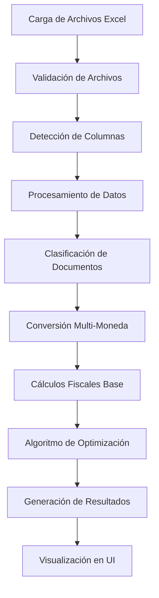

# Documentación - Calculadora de IVA Guatemala

## Descripción General

Esta aplicación web está diseñada para ayudar a las empresas guatemaltecas a calcular el IVA (Impuesto al Valor Agregado) de manera automatizada, procesando archivos Excel de ventas y compras para generar declaraciones fiscales precisas.

## Características Principales

### 🎯 Funcionalidades Core
- **Procesamiento de Excel**: Carga y procesa archivos de ventas y compras en formato Excel
- **Multi-moneda**: Soporte completo para USD y GTQ con conversión automática
- **Clasificación de documentos**: Identifica automáticamente FACT (facturas), NDEB (notas de débito) y NCRE (notas de crédito)
- **Algoritmo de optimización**: Encuentra la combinación óptima de facturas de compra para maximizar el crédito fiscal
- **Análisis detallado**: Proporciona breakdowns completos por tipo de documento y moneda

### 🏗️ Arquitectura Técnica
- **Frontend**: Nuxt 4 + Vue 3 + TypeScript + PrimeVue + TailwindCSS
- **Backend**: Nitro (servidor integrado de Nuxt)
- **Procesamiento**: ExcelJS para archivos, algoritmos personalizados para cálculos

---

## Algoritmo de Optimización de Facturas

### 🧠 Problema a Resolver

El objetivo es encontrar el conjunto óptimo de facturas de compra que permita utilizar el máximo crédito fiscal posible sin exceder el IVA de ventas, cumpliendo con la regulación fiscal guatemalteca.

**Restricción principal**: `IVA_credito_utilizado ≤ IVA_ventas`

### 🔍 Enfoque del Algoritmo

El sistema utiliza una variación del **algoritmo de la mochila (knapsack)** con programación dinámica, adaptado específicamente para optimización fiscal.

#### Parámetros de Entrada
- `purchasesData`: Array de facturas de compra procesadas
- `salesTaxAmount`: Monto total de IVA de ventas (objetivo a cubrir)
- `columnMappings`: Mapeo de columnas del Excel
- `exchangeRate`: Tasa de cambio USD→GTQ

#### Proceso de Optimización

```typescript
// 1. PREPARACIÓN DE DATOS
const optimizedInvoices = this.createOptimizedInvoiceList(
  purchasesData,
  columnMappings,
  exchangeRate
)

// 2. APLICACIÓN DEL ALGORITMO
const selectedInvoices = this.findOptimalCombination(
  optimizedInvoices,
  salesTaxAmount
)
```

### 📊 Implementación Detallada

#### Fase 1: Creación de Lista Optimizada

```typescript
createOptimizedInvoiceList(purchasesData, columnMappings, exchangeRate) {
  const invoices = []
  
  for (const row of purchasesData) {
    // Filtrar solo facturas con IVA > 0
    const taxAmount = parseNumericValue(row[columnMappings.tax])
    if (taxAmount <= 0) continue
    
    // Conversión de moneda uniforme
    const convertedTaxAmount = currency === 'USD' 
      ? taxAmount * exchangeRate 
      : taxAmount
    
    // Clasificación automática de documento
    const documentType = DocumentClassificationService.classifyDocument(row)
    
    invoices.push({
      invoiceNumber,
      taxpayerName,
      totalAmount: convertedTotalAmount,
      taxAmount: convertedTaxAmount,
      currency,
      documentType,
      originalRow: row
    })
  }
  
  // Ordenamiento por IVA descendente para optimización
  return invoices.sort((a, b) => b.taxAmount - a.taxAmount)
}
```

#### Fase 2: Algoritmo de Programación Dinámica

El algoritmo implementa una **mochila 0/1 modificada** donde:
- **Capacidad**: IVA de ventas (convertido a centavos para precisión)
- **Peso de cada item**: IVA de la factura (en centavos)
- **Valor de cada item**: IVA de la factura (maximizamos cobertura)

```typescript
findOptimalCombination(invoices, targetAmount) {
  const n = invoices.length
  const target = Math.floor(targetAmount * 100) // Centavos para precisión
  
  // Matrices de programación dinámica
  const dp = Array(n + 1).fill().map(() => Array(target + 1).fill(false))
  const parent = Array(n + 1).fill().map(() => Array(target + 1).fill(-1))
  
  dp[0][0] = true // Caso base
  
  // Llenar matriz DP
  for (let i = 1; i <= n; i++) {
    const invoice = invoices[i - 1]
    const weight = Math.floor(invoice.taxAmount * 100)
    
    for (let w = 0; w <= target; w++) {
      // No incluir factura actual
      dp[i][w] = dp[i - 1][w]
      if (dp[i][w]) parent[i][w] = 0
      
      // Incluir factura actual (si es posible y beneficioso)
      if (weight <= w && dp[i - 1][w - weight]) {
        if (!dp[i][w] || shouldPreferThisCombination(invoice)) {
          dp[i][w] = true
          parent[i][w] = 1
        }
      }
    }
  }
  
  // Encontrar mejor solución (mayor w donde dp[n][w] = true)
  let bestAmount = 0
  for (let w = target; w >= 0; w--) {
    if (dp[n][w]) {
      bestAmount = w
      break
    }
  }
  
  // Reconstruir solución óptima
  return reconstructSolution(parent, invoices, bestAmount)
}
```

### 🎯 Criterios de Priorización

El algoritmo aplica preferencias inteligentes para casos de empate:

```typescript
shouldPreferThisCombination(currentInvoice) {
  // 1. MÁXIMA PRIORIDAD: Facturas regulares
  if (currentInvoice.documentType === 'FACT') return true
  
  // 2. MÍNIMA PRIORIDAD: Notas de crédito (reducen el crédito)
  if (currentInvoice.documentType === 'NCRE') return false
  
  // 3. PRIORIDAD MEDIA: Notas de débito y otros
  return Math.random() > 0.5 // Diversificación aleatoria
}
```

### 📈 Métricas de Resultado

```typescript
return {
  targetTaxAmount,           // IVA objetivo (ventas)
  achievedTaxAmount,         // IVA logrado con facturas seleccionadas
  coveragePercentage,        // % de cobertura (achievedTaxAmount/targetTaxAmount * 100)
  selectedInvoices,          // Array de facturas óptimas
  totalSelectedInvoices,     // Cantidad de facturas seleccionadas
  remainingTaxGap           // Diferencia no cubierta
}
```

---

## Clasificación de Documentos

### 🏷️ Sistema de Clasificación Automática

El sistema identifica automáticamente tipos de documentos basándose en la columna `"Tipo de DTE (nombre)"`:

```typescript
classifyDocument(row) {
  const documentTypeValue = row[DOCUMENT_TYPE_COLUMN]
  const docType = String(documentTypeValue).toUpperCase().trim()
  
  if (docType.includes('NDEB')) return 'NDEB'  // Nota de Débito
  if (docType.includes('NCRE')) return 'NCRE'  // Nota de Crédito  
  if (docType.includes('FACT')) return 'FACT'  // Factura
  
  return 'OTHER' // Otros documentos
}
```

### 📊 Impacto en Cálculos Fiscales

| Tipo | Descripción | Efecto en IVA | Prioridad en Algoritmo |
|------|-------------|---------------|------------------------|
| **FACT** | Facturas regulares | ➕ Aumenta crédito fiscal | 🔴 **ALTA** |
| **NDEB** | Notas de débito | ➕ Aumenta monto/IVA | 🟡 **MEDIA** |
| **NCRE** | Notas de crédito | ➖ Reduce monto/IVA | 🟢 **BAJA** |
| **OTHER** | Otros documentos | ➕ Tratado como factura | 🟡 **MEDIA** |

---

## Análisis Multi-Moneda

### 💱 Conversión Automática

Todo el sistema opera con **GTQ como moneda base**, realizando conversiones automáticas:

```typescript
// Conversión uniforme
const convertedAmount = currency === 'USD' 
  ? amount * exchangeRate 
  : amount

// Tracking separado para reporte
currencyBreakdown: {
  usd: {
    count: usdInvoiceCount,
    total: usdAmountInGTQ,        // Convertido
    originalTotal: usdAmount      // Original en USD
  },
  gtq: {
    count: gtqInvoiceCount,
    total: gtqAmount
  }
}
```

### 📊 Beneficios del Enfoque Multi-Moneda

1. **Precisión**: Cálculos en moneda base uniforme
2. **Transparencia**: Muestra montos originales y convertidos
3. **Flexibilidad**: Tasa de cambio configurable por período
4. **Cumplimiento**: Alineado con regulaciones SAT Guatemala

---

## Componentes de UI

### 🎨 DocumentTypeBreakdown.vue

Visualiza el análisis detallado por tipo de documento:

- **Facturas Regulares**: Fondo azul, ícono de documento
- **Notas de Débito**: Fondo naranja, ícono de tendencia ascendente  
- **Notas de Crédito**: Fondo verde, ícono de tendencia descendente
- **Resumen Total**: Cálculo de tasa efectiva de IVA

### 📋 OptimizedInvoicesTable.vue

Presenta los resultados del algoritmo de optimización:

**Características principales:**
- DataTable interactiva con paginación y ordenamiento
- Métricas de cobertura con indicadores visuales de color
- Distribución por tipo de documento con badges
- Cálculos de eficiencia (ratio IVA/Total)
- Soporte multi-moneda con conversiones visibles

**Indicadores de rendimiento:**
- 🟢 Verde: Cobertura ≥95%
- 🟡 Amarillo: Cobertura 80-94%  
- 🔴 Rojo: Cobertura <80%

---

## Flujo de Procesamiento

### 📋 Proceso Completo



### ⚙️ Servicios Backend

1. **FileValidationService**: Validación de archivos Excel
2. **ExcelProcessingService**: Extracción y procesamiento de datos
3. **DocumentClassificationService**: Clasificación automática de documentos
4. **InvoiceOptimizationService**: Algoritmo de optimización fiscal
5. **TaxCalculationService**: Cálculos fiscales centralizados

---

## Ventajas del Sistema

### 🚀 Beneficios Técnicos

- **Precisión**: Algoritmo matemático garantiza la solución óptima
- **Eficiencia**: Complejidad O(n × target) vs fuerza bruta O(2^n)
- **Escalabilidad**: Maneja miles de facturas sin problemas de rendimiento
- **Mantenibilidad**: Arquitectura SOLID con separación clara de responsabilidades

### 📈 Beneficios de Negocio

- **Maximización de crédito fiscal**: Aprovecha al máximo las deducciones permitidas
- **Cumplimiento automático**: Respeta límites legales automáticamente
- **Ahorro de tiempo**: Reduce horas de trabajo manual de contadores
- **Trazabilidad**: Documenta cada decisión del algoritmo para auditorías

### 🛡️ Confiabilidad

- **Validaciones múltiples**: Verificación en frontend y backend
- **Manejo de errores**: Feedback claro para casos problemáticos  
- **Tipado estricto**: TypeScript previene errores de datos
- **Testing ready**: Arquitectura preparada para pruebas automatizadas

---

## Casos de Uso Típicos

### Escenario 1: Empresa con Crédito Fiscal Completo
- **Situación**: IVA compras > IVA ventas
- **Resultado**: Algoritmo selecciona facturas hasta cubrir 100% del IVA ventas
- **Beneficio**: Utilización máxima del crédito disponible

### Escenario 2: Empresa con Crédito Fiscal Parcial  
- **Situación**: IVA compras < IVA ventas
- **Resultado**: Selecciona todas las facturas disponibles
- **Beneficio**: Minimiza el IVA por pagar

### Escenario 3: Empresa Solo USD
- **Situación**: Todas las facturas en dólares
- **Resultado**: Conversión automática a GTQ para cálculos
- **Beneficio**: Simplifica la contabilidad multi-moneda

---

## Próximas Mejoras

### 🔮 Funcionalidades Planificadas

1. **Exportación avanzada**: PDF, Excel con formatos SAT
2. **Histórico**: Almacenamiento de cálculos previos  
3. **API REST**: Integración con sistemas contables
4. **Machine Learning**: Predicción de patrones fiscales
5. **Validaciones SAT**: Verificación automática con API oficial

### 🎯 Optimizaciones Técnicas

1. **Worker threads**: Procesamiento paralelo para archivos grandes
2. **Caché inteligente**: Almacenamiento de cálculos repetitivos
3. **Streaming**: Procesamiento de archivos enormes sin cargar en memoria
4. **Algoritmo evolutivo**: Optimización adicional para casos extremos

---

*Esta documentación cubre los aspectos técnicos y funcionales principales del sistema. Para detalles específicos de implementación, consulta el código fuente en los directorios `/server/services/` y `/app/components/`.*